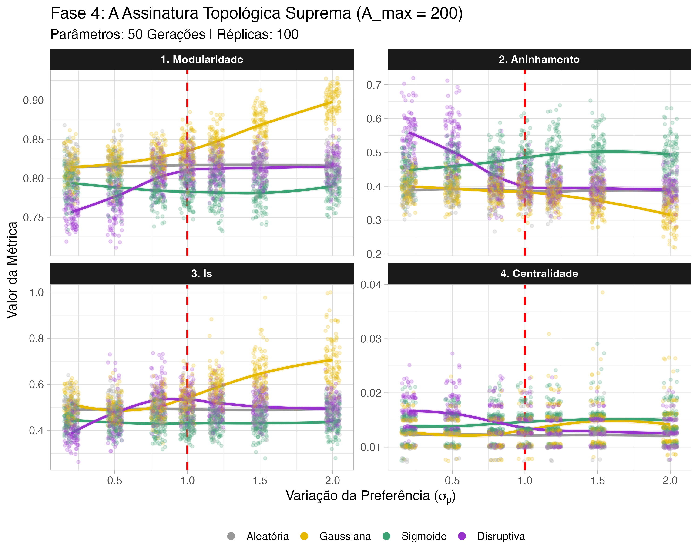
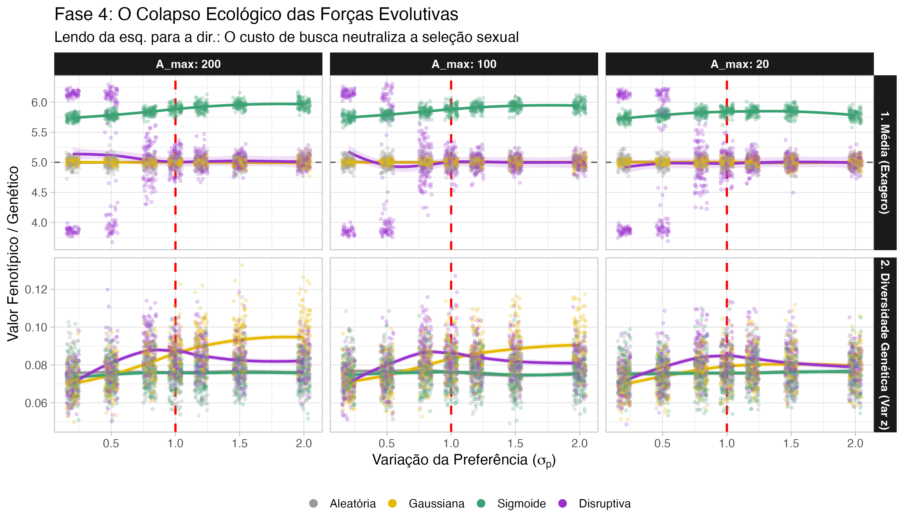
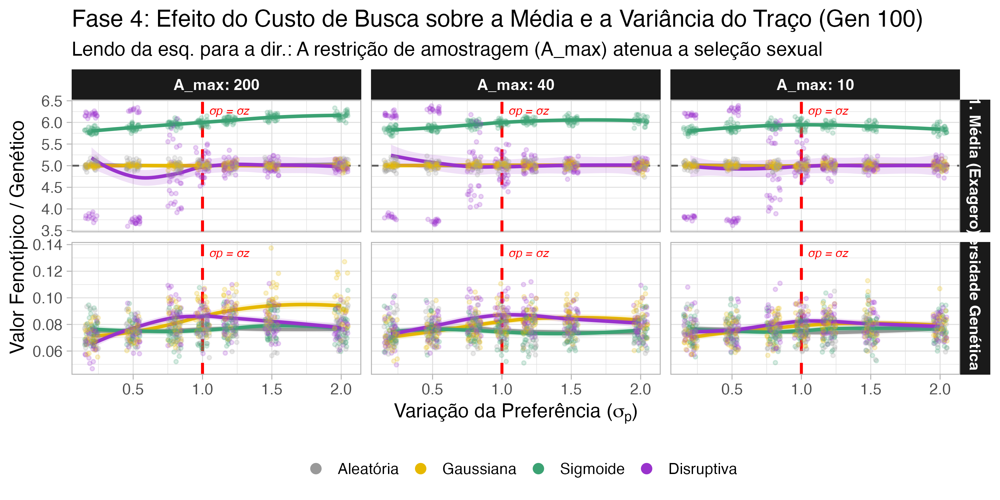
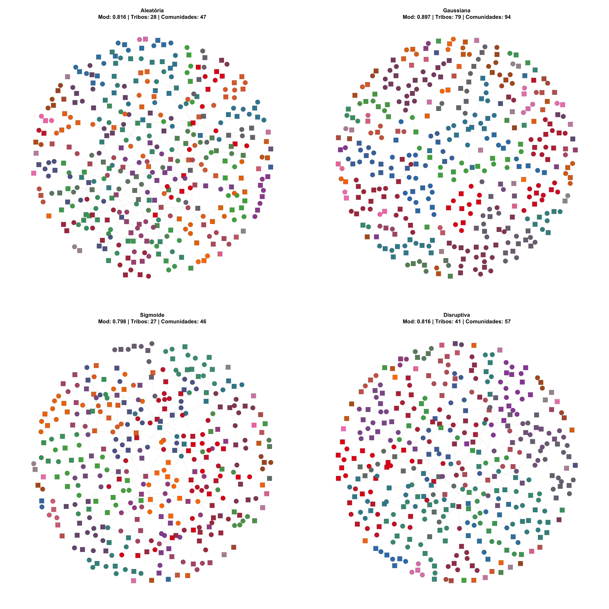
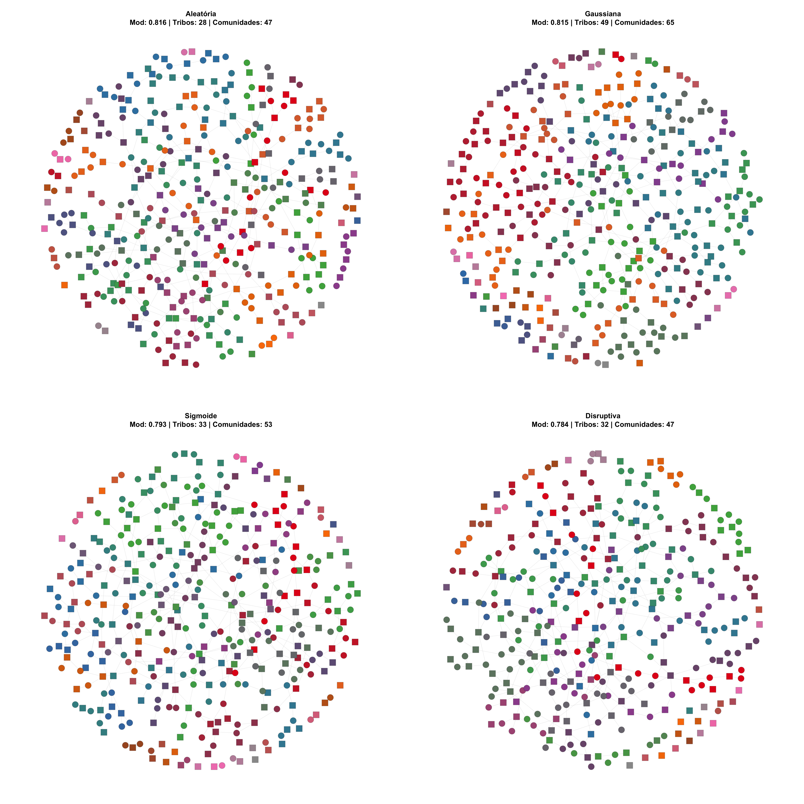
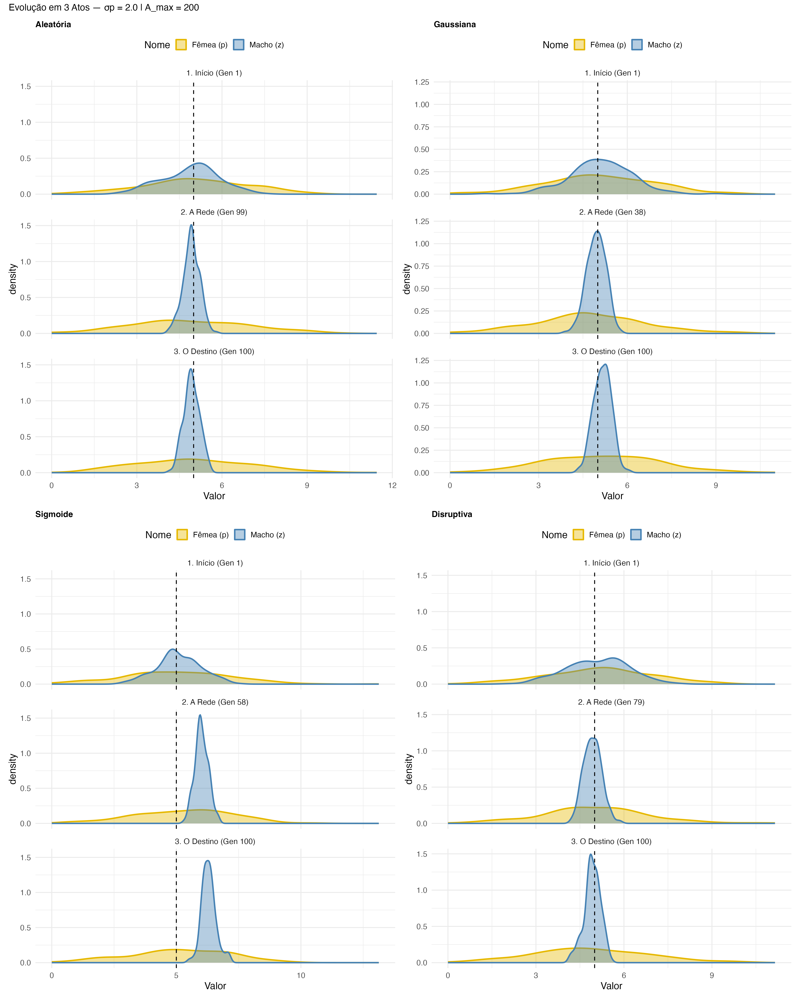
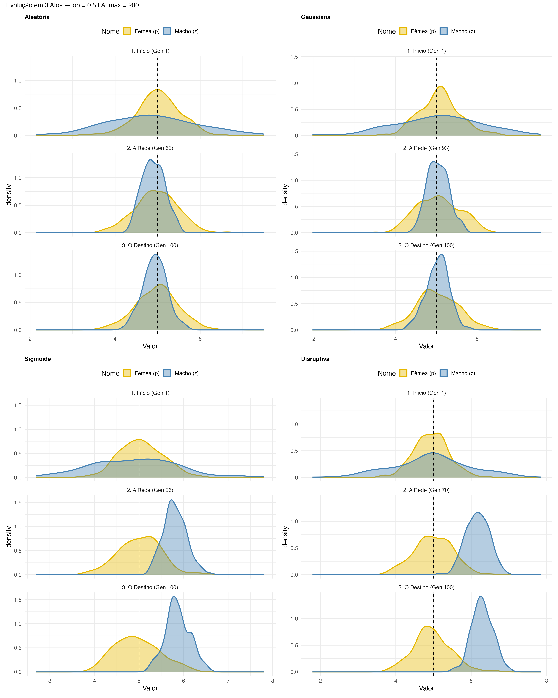

```{r setup, include=FALSE}
knitr::opts_chunk$set(echo = TRUE, warning = FALSE, message = FALSE,
                      fig.align = "center", out.width = "90%")
library(dplyr)
library(tidyr)
library(ggplot2)
library(knitr)
library(kableExtra)
```

---

# Desenho Experimental

## Modelo Individual-Based (IBM)

Simulamos uma população de **N = 200 machos** e **N = 200 fêmeas** ao longo de **100 gerações**, com **30 réplicas independentes** por cenário. O espaço de parâmetros é:

| Parâmetro | Valores | Descrição |
|---|---|---|
| Curva de preferência | uniform, gaussian, sigmoid, u-shaped | Regime de seleção sexual |
| $\sigma_p$ | 0.2, 0.5, 0.8, 1.0, 1.2, 1.5, 2.0 | Variação da preferência feminina |
| $A_{max}$ | 200, 40, 10 | Machos amostrados por fêmea (100%, 20%, 5% de N) |

**Total de cenários:** 4 × 7 × 3 × 30 = **2.520 simulações**

## Ciclo de vida por geração

Cada geração segue quatro etapas:

**1. Seleção de viabilidade** (seleção natural estabilizadora):

$$V_j = \exp\left(-0.2 \cdot (z_j - \phi)^2\right), \quad \phi = 5.0$$

Machos com traço $z_j$ muito diferente do ótimo ecológico $\phi = 5$ têm menor probabilidade de sobreviver.

**2. Acasalamento:** cada fêmea sorteia entre 1 e 5 parceiros (poliandria máxima = 5) de entre $A_{max}$ machos amostrados aleatoriamente. A probabilidade de aceitar o macho $j$ depende da curva de preferência:

| Regime | Função $P_{ij}$ |
|---|---|
| Uniforme (nula) | $P_{ij} = 0.5$ |
| Gaussiana (estabilizadora) | $P_{ij} = \exp\!\left(-s_i(z_j - p_i)^2\right)$ |
| Sigmoide (direcional) | $P_{ij} = \dfrac{1}{1 + \exp(-s_i(z_j - p_i))}$ |
| U-shaped (disruptiva) | $P_{ij} = 1 - \exp\!\left(-s_i(z_j - p_i)^2\right)$ |

onde $p_i \sim N(5,\, \sigma_p^2)$ é a preferência da fêmea $i$ e $s_i \sim N(2,\, 0.2^2)$ é a sua discriminação.

**3. Fecundidade neutra** (ponto central do desenho experimental):

$$F_i = \begin{cases} F_{base} = 50 & \text{se a fêmea acasalou} \\ 0 & \text{caso contrário} \end{cases}$$

A poliandria **não aumenta** a fecundidade da fêmea. O número de filhotes é fixo em 50, independente do número de parceiros. A paternidade é distribuída entre os parceiros via *fair raffle* (competição espermática).

**Por que fecundidade neutra?** Para isolar o efeito puramente topológico da rede. Se a poliandria trouxesse benefício direto, não saberíamos se a evolução do traço foi causada pela estrutura da rede ou pelo incentivo de ter mais parceiros.

**4. Herança quantitativa:**

$$z_{filho} = \frac{z_{pai} + z_{mãe}}{2} + \varepsilon, \quad \varepsilon \sim N(0,\, 0.2^2)$$

## Métricas de rede calculadas por geração

A cada geração, a rede bipartita macho-fêmea é usada para calcular:

**Modularidade Q:** grau de compartimentação da rede em módulos:

$$Q = \frac{1}{2m} \sum_{ij} \left[ A_{ij} - \frac{k_i k_j}{2m} \right] \delta(c_i,\, c_j)$$

onde $A_{ij}$ é a matriz de adjacência, $k_i$ o grau do nó $i$, $m$ o número total de arestas, e $\delta(c_i, c_j) = 1$ se $i$ e $j$ pertencem à mesma comunidade. $Q \in [0, 1]$: valores altos indicam redes fragmentadas em grupos de machos e fêmeas que se acasalam preferencialmente entre si.

> **Implementação:** `igraph::cluster_louvain()` + `igraph::modularity()` (pacote `igraph`). O algoritmo de Louvain é aplicado à projecção não-dirigida da rede bipartita (machos + fêmeas como nós, cópulas como arestas). A alternativa bipartite-específica seria `bipartite::computeModules()`, mas é 100-1000× mais lenta.

**Aninhamento NODF** (*Nestedness based on Overlap and Decreasing Fill*): grau de hierarquização das interações:

$$\text{NODF} = \frac{1}{\binom{R}{2} + \binom{C}{2}} \left( \sum_{i < j}^{R} N_{ij}^{\text{linha}} + \sum_{i < j}^{C} N_{ij}^{\text{col}} \right)$$

Para cada par de linhas $i, j$ com $k_i > k_j$: $N_{ij} = \dfrac{\text{interações partilhadas}}{k_j}$; se $k_i = k_j$ então $N_{ij} = 0$. $\text{NODF} \in [0, 100]$: valores altos indicam que os machos menos populares são subconjuntos dos mais populares (estrutura hierárquica típica do *runaway*).

> **Implementação:** `bipartite::nested(M, method = "NODF")` (pacote `bipartite`). A função recebe a matriz de incidência $M$ (machos × fêmeas) directamente, sem projecção.

**Centralização** (degree centralization): concentração de acasalamentos na rede:

$$C_D = \frac{\sum_{i=1}^{n} (k_{\max} - k_i)}{(n-1)^2}$$

onde $k_i$ é o grau do nó $i$ e $k_{\max}$ é o grau máximo observado. $C_D \in [0, 1]$: valores altos indicam que poucos nós concentram a maioria das ligações.

> **Implementação:** `igraph::centr_degree(g, mode = "all")$centralization` (pacote `igraph`). Calculada sobre a rede completa (machos + fêmeas), não só machos. Para centralização exclusivamente masculina, $I_s$ é mais informativo e directo.

**$I_s$** (oportunidade de seleção sexual): variação padronizada do sucesso reprodutivo masculino:

$$I_s = \frac{\text{Var}(k)}{\bar{k}^2}$$

onde $k$ = número de parceiras por macho (= `rowSums(M)`). Equivale ao coeficiente de variação ao quadrado; mede a intensidade *atual* da seleção sexual na população (Wade 1979; Shuster & Wade 2003).

> **Implementação:** calculado directamente em R base: `var(rowSums(M)) / mean(rowSums(M))^2`, sem pacote externo.

---

# Resultados

## Assinatura Topológica das Curvas de Preferência {.tabset}

### Gráfico

```{r plot-a, echo=FALSE, fig.cap="**Figura 1.** Métricas topológicas da rede em função de σ_p (A_max = 200, geração 100). A linha vermelha tracejada marca o tipping point em σ_p = 1.0."}

```

### Interpretação

A questão central desta secção é: **à medida que σp aumenta (maior variação individual na preferência feminina), cada curva gera uma assinatura topológica distinta?**

Os dados indicam que sim, e que a forma da função de preferência governa como a heterogeneidade de preferência se traduz em estrutura de rede:

- **Sigmoide**: ao longo do gradiente de σp, mantém o maior aninhamento e reduz a modularidade. O aumento de σp amplifica a hierarquia na rede. Corresponde isso visualmente a uma rede com poucos machos altamente conectados? (Ver Secção 2.5.)
- **Gaussiana**: ao longo de σp, perde aninhamento (-37%) e ganha modularidade (+9%). A heterogeneidade de preferência fragmenta a rede em grupos. Esse padrão visual é consistente com "cliques modulares" de fêmeas que partilham os mesmos machos preferidos? (Ver Secção 2.5.)
- **U-shaped**: a modularidade aumenta com σp, especialmente sob restrição de amostragem. A heterogeneidade de preferência cria dois grupos distintos na rede? Isso seria consistente com dois morfos masculinos — mas precisamos ver a distribuição de $z$ para confirmar (Ver Secção 2.6).
- **Uniforme**: referência nula. A topologia não responde ao gradiente de σp, confirmando que a assinatura das outras curvas é gerada pela forma da função de preferência, não por ruído.

O **tipping point em $\sigma_p = 1.0 = \sigma_z$** é o ponto onde a variação individual da preferência feminina iguala a variação genética inicial dos machos. Abaixo desse valor, as métricas topológicas são relativamente estáveis entre curvas; acima, as assinaturas divergem e amplificam-se.

---

## A Restrição de Amostragem Dissolve a Assinatura Topológica? {.tabset}

### Gráfico

```{r plot-d, echo=FALSE, fig.cap="**Figura 2.** Modularidade e aninhamento em função de σ_p, para os três níveis de A_max (geração 100). A linha tracejada vertical marca σ_p = σ_z = 1.0. Lendo da esquerda para a direita: como a restrição de amostragem modifica a assinatura topológica de cada curva ao longo do gradiente de σ_p."}
img_d <- "Resultados_Artigo/Fase4_TodasAsCurvas/Graficos/Fase4_PlotD_TopologiaAmax.png"
if (file.exists(img_d)) {
  knitr::include_graphics(img_d)
} else {
  cat("*Gráfico não encontrado — rode o Script 07 primeiro.*")
}
```

### Interpretação

Esta secção testa directamente se $A_{max}$ actua como ruído que **dissolve a estrutura da rede** gerada por cada curva de preferência ao longo do gradiente de σp.

**O que procurar no gráfico:** as assinaturas de cada curva (distância entre as linhas) mantêm-se à medida que passamos de A_max=200 para A_max=10? Se as linhas convergirem (tornarem-se indistinguíveis), o ruído ecológico neutralizou a assinatura topológica.

- **Modularidade:** à medida que A_max diminui, as curvas convergem? A gaussiana (alta modularidade) e a sigmoide (baixa modularidade) continuam separadas sob A_max=10?
- **Aninhamento:** a hierarquia da sigmoide e o anti-aninhamento da gaussiana resistem à restrição de amostragem, ou colapsam sob A_max=10?
- **Acima de σp = 1.0 (= σz):** a divergência entre curvas amplifica-se ou atenua-se com A_max restrito?

A resposta a estas perguntas determina se os caminhos topo-evolutivos são **robustos** ao ruído ecológico ou se dependem de condições de alta capacidade de amostragem.

---

## Efeito do Custo de Busca sobre a Evolução do Traço {.tabset}

### Gráfico

```{r plot-b, echo=FALSE, fig.cap="**Figura 2.** Média do traço masculino (z̄) e variância do traço (Var z) na geração 100 em função de σ_p, para os três níveis de A_max. A linha tracejada vertical marca σ_p = σ_z = 1.0. A linha tracejada horizontal marca φ = 5.0."}

```

### Interpretação

Esta secção testa se os caminhos topo-evolutivos gerados por cada curva são robustos ao ruído ecológico: **$A_{max}$ restringe a escolha feminina e actua como ruído que pode dissolver a estrutura da rede**.

**Variância do traço (Var z) — diversidade genética:** reduzida 88-90% em relação ao valor inicial ($\sigma_z^2 = 1.0$) em todos os regimes. A poliandria sem benefício directo não resgata variância. O efeito de $A_{max}$ sobre Var z é pequeno na maioria das curvas, com uma excepção visível: na **curva gaussiana**, $A_{max}=10$ preserva mais Var z do que $A_{max}=200$. A hipótese é que a restrição de amostragem limita a eficácia do acasalamento assortativo, reduzindo a perda de diversidade. Será esse efeito específico da gaussiana ou aparece nas outras curvas a $\sigma_p$ altos? (Ver Tabela 1.)

**Média do traço (z̄) — exageração fenotípica:** o gradiente de $\sigma_p$ não altera z̄ nas curvas uniforme, gaussiana e u-shaped. Apenas a sigmoide gera deslocamento sistemático, e esse deslocamento aumenta com $\sigma_p$:

| Curva | $A_{max}=200$ | $A_{max}=40$ | $A_{max}=10$ |
|---|---|---|---|
| Uniforme | $z̄ \approx 5.04$ | $z̄ \approx 5.00$ | $z̄ \approx 5.00$ |
| Gaussiana | $z̄ \approx 5.01$ | $z̄ \approx 5.00$ | $z̄ \approx 5.00$ |
| **Sigmoide** | **$z̄ = 6.16$ (+23%)** | **$z̄ = 6.04$ (+21%)** | **$z̄ = 5.84$ (+17%)** |
| U-shaped | $z̄ \approx 4.98$ | $z̄ \approx 5.01$ | $z̄ \approx 5.01$ |

O gradiente $A_{max}=200 > 40 > 10$ atenua o deslocamento da sigmoide, mas não o elimina. O custo de busca actua como ruído ecológico que **reduz, mas não neutraliza**, o caminho topo-evolutivo direcional gerado pela preferência sigmoide.

---

## Evidência Correlacional: Topologia → Evolução {.tabset}

### Gráfico

```{r plot-c, echo=FALSE, fig.cap="**Figura 3.** Regressões lineares entre métricas topológicas e evolutivas (σ_p = 2.0, A_max = 200, geração 100). Cada ponto é uma réplica independente."}

```

### Interpretação

Esta secção pergunta: **a topologia da rede medeia o caminho evolutivo, ou é apenas uma covariável da curva de preferência?** Cada ponto é uma réplica independente com σp = 2.0 e A_max = 200.

- **Modularidade → Var(z):** correlação positiva entre réplicas. Dentro do mesmo regime de preferência, réplicas com rede mais modular apresentam maior Var z. A u-shaped (rede mais modular) rescue diversidade genética; a sigmoide (rede menos modular) reduz-a. Esse padrão é consistente com a hipótese de que **a topologia modular preserva diversidade genética** — mas confirmar causalidade requereria manipulação experimental da estrutura da rede. (Ver Secção 2.5.)
- **Aninhamento → z̄:** correlação positiva para a sigmoide. Dentro do regime sigmoide, réplicas com maior aninhamento apresentam maior deslocamento de z̄. O gradiente de σp alimenta esse caminho: mais σp gera mais aninhamento, que gera mais exageração. Como o aninhamento traduz preferência heterogénea em exageração do traço? (Ver Secções 2.5 e 3.)

---

## Tabela de Resultados: Geração 1 → Geração 100

```{r tabela, echo=FALSE}
csv_files <- list.files("Resultados_Artigo/Fase4_TodasAsCurvas/Dados/",
                        pattern = "Tabela_Gen1_vs_Gen.*\\.csv",
                        full.names = TRUE)
df <- if (length(csv_files) > 0) read.csv(csv_files[1]) else NULL

if (!is.null(df)) {
  df %>%
    filter(sigma_p == 2.0, Metrica %in% c("zbar_males","varz_males","Modularity","Nestedness","I_s")) %>%
    mutate(
      Metrica = case_when(
        Metrica == "zbar_males"     ~ "z̄ (média do traço)",
        Metrica == "varz_males"     ~ "Var(z) diversidade",
        Metrica == "Modularity"     ~ "Modularidade",
        Metrica == "Nestedness"     ~ "Aninhamento (NODF)",
        Metrica == "I_s"            ~ "Is (oportunidade sel.)"
      ),
      tipo_selecao = case_when(
        tipo_selecao == "uniform"   ~ "Uniforme",
        tipo_selecao == "gaussian"  ~ "Gaussiana",
        tipo_selecao == "sigmoid"   ~ "Sigmoide",
        tipo_selecao == "u-shaped"  ~ "U-shaped"
      ),
      Amax = paste0("A=", encounters_n),
      Delta_pct = round(Delta_pct, 1)
    ) %>%
    select(tipo_selecao, Metrica, Amax, Gen_inicial, Gen_final, Delta_pct) %>%
    mutate(across(c(Gen_inicial, Gen_final), \(x) round(x, 3))) %>%
    rename(Curva = tipo_selecao, `Gen 1` = Gen_inicial,
           `Gen 100` = Gen_final, `Δ%` = Delta_pct) %>%
    arrange(Amax, Metrica, Curva) %>%
    kable(caption = "**Tabela 1.** Valores médios (30 réplicas) das métricas na geração 1 e 100, σp = 2.0.",
          align = c("l","l","c","r","r","r")) %>%
    kable_styling(bootstrap_options = c("striped", "hover", "condensed"),
                  full_width = FALSE, font_size = 13) %>%
    column_spec(6, color = ifelse(
      df %>% filter(sigma_p == 2.0, Metrica %in% c("zbar_males","varz_males",
                    "Modularity","Nestedness","I_s")) %>%
        mutate(Delta_pct = round(Delta_pct, 1)) %>% pull(Delta_pct) > 0,
      "forestgreen", "firebrick"
    ))
} else {
  cat("*Tabela não encontrada — rode o Script 07 primeiro.*")
}
```

### Visualização: Gen 1 → Gen 100 (Dumbbell)

```{r dumbell-plot, echo=FALSE, fig.cap="**Figura 3b.** Mudança nas métricas topológicas da geração 1 para a geração final (σp = 2.0). Círculo aberto = Geração 1, círculo fechado = Geração final. O comprimento e direção do segmento refletem a magnitude e o sinal da mudança. Rótulos = Δ absoluto médio (30 réplicas)."}
img_e <- "Resultados_Artigo/Fase4_TodasAsCurvas/Graficos/Fase4_PlotE_Dumbell_Gen1vsGenFinal.png"
if (file.exists(img_e)) {
  knitr::include_graphics(img_e)
} else {
  cat("*Gráfico não encontrado — rode o Script 07 para gerar o Plot E.*")
}
```

**Leitura do gráfico:** cada linha liga o valor médio da métrica na geração 1 (círculo aberto) ao valor na geração final (círculo fechado). A seleção sigmoide, com acesso irrestrito (A_max = 200), é a que mais desloca o aninhamento, enquanto a curva uniforme serve de referência de deriva neutra. Será que a modulação do aninhamento pela sigmoide acompanha o exagero do traço visto no Plot B (ver Secção 2.3)? Os gráficos das redes representativas (Secção 2.6) ajudam a responder.

---

## Redes Representativas e a Evolução em 3 Atos {.tabset}

### Estrutura das Redes (σ_p = 2.0)

```{r rede-sigmap2, echo=FALSE, fig.cap="**Figura 4.** Redes bipartitas macho-fêmea representativas para σ_p = 2.0, A_max = 200. Quadrados = machos, círculos = fêmeas. Cores = comunidades Louvain. A rede com modularity mais próxima da média estável foi seleccionada entre 20 réplicas."}

```

### Estrutura das Redes (σ_p = 0.5)

```{r rede-sigmap05, echo=FALSE, fig.cap="**Figura 5.** Redes representativas para σ_p = 0.5, A_max = 200. Com baixa variação de preferência, as diferenças entre curvas são mais subtis (controlo para comparação com σ_p = 2.0)."}

```

### Evolução em 3 Atos (σ_p = 2.0)

```{r hist-sigmap2, echo=FALSE, fig.cap="**Figura 6.** Distribuições do traço masculino z e da preferência feminina p em três momentos: Geração 1 (início), rede representativa (fase estável), e geração final. Linha tracejada = ótimo ecológico φ = 5."}

```

### Evolução em 3 Atos (σ_p = 0.5)

```{r hist-sigmap05, echo=FALSE, fig.cap="**Figura 7.** Mesmo painel para σ_p = 0.5. Com preferências femininas pouco variáveis, o runaway sigmoide é atenuado e os morfos U-shaped são menos pronunciados."}

```

### Interpretação

**O que os números dizem sobre a estrutura das redes (σ_p = 2.0, A_max = 200):**

- **Sigmoide**: apresenta o maior aninhamento e a menor modularidade entre as quatro curvas. Olhando para a rede (painéis acima), essa assinatura numérica traduz-se visualmente numa hierarquia clara?
- **Gaussiana**: perde aninhamento e ganha modularidade ao longo do tempo. A estrutura visual é consistente com grupos de fêmeas que partilham os mesmos machos preferidos?
- **U-shaped**: mantém aninhamento semelhante ao início, mas aumenta a modularidade. Isso é consistente com a hipótese de dois módulos correspondentes a dois morfos masculinos (ver Secção 2.6 para a análise formal da distribuição de $z$)?
- **Uniforme**: serve de referência. A rede gerada é a mais aleatória e homogénea?

**O mecanismo U-shaped:**

A função $P_{ij} = 1 - \exp(-s_i(z_j - p_i)^2)$ penaliza machos próximos da preferência da fêmea e favorece os extremos. Em conflito com a seleção viabilidade (estabilizadora em φ = 5), o equilíbrio pode gerar dois atratores fenotípicos. A rede modular reflecte essa bipartição? Machos do morfo "alto" e do morfo "baixo" pertencem a comunidades distintas com conjuntos de fêmeas separados? A Secção 2.6 testa isso formalmente.

---

## Trajetórias Temporais: Como Chega a Geração 100? {.tabset}

### Topologia ao longo do tempo (Espiadinha 7)

```{r esp7, echo=FALSE, fig.cap="**Figura 9.** Trajetórias das métricas topológicas (Modularidade e Aninhamento) geração-a-geração, para A_max = 200 (esquerda) e A_max = 10 (direita). Linhas = médias entre réplicas. O eixo Y é consistente entre painéis para permitir comparação directa do efeito de A_max."}
img_esp7 <- "Resultados_Artigo/Fase4_TodasAsCurvas/Graficos/Espiadinhas/Espiadinha7_Topologia_Amax.png"
if (file.exists(img_esp7)) {
  knitr::include_graphics(img_esp7)
} else {
  cat("*Gráfico não encontrado — rode o Script 07 primeiro.*")
}
```

**Leitura:** em que geração as curvas se separam? A divergência começa cedo (gerações 1-10) ou é gradual? A comparação entre A_max = 200 e A_max = 10 mostra se a restrição de amostragem atrasa ou dissolve essa separação.

### Traço masculino ao longo do tempo (Espiadinha 8)

```{r esp8, echo=FALSE, fig.cap="**Figura 10.** Trajetórias da média (z̄) e variância (Var z) do traço masculino ao longo das gerações, para A_max = 200 (esquerda) e A_max = 10 (direita). Linha tracejada = φ = 5.0 (ótimo ecológico)."}
img_esp8 <- "Resultados_Artigo/Fase4_TodasAsCurvas/Graficos/Espiadinhas/Espiadinha8_Trajetorias_Evolutivas.png"
if (file.exists(img_esp8)) {
  knitr::include_graphics(img_esp8)
} else {
  cat("*Gráfico não encontrado — rode o Script 07 primeiro.*")
}
```

**Leitura:** quando é que o *runaway* sigmoide arranca? O deslocamento de z̄ é linear ao longo das gerações ou há um ponto de inflexão? A variância colapsa ao mesmo ritmo em todas as curvas ou a u-shaped preserva-a mais tempo?

### Interpretação

As trajetórias respondem à pergunta que os gráficos da geração 100 não conseguem responder: **a geração 100 é um estado estável ou ainda está a evoluir?**

- Se as curvas das Espiadinhas 7 e 8 estabilizaram antes da geração 100, os resultados da Tabela 1 reflectem um equilíbrio dinâmico.
- Se ainda estão a mudar na geração 100, as estimativas podem subestimar os efeitos a longo prazo, o que justifica aumentar o número de gerações (ver Próximos Passos).

A comparação entre A_max = 200 e A_max = 10 nestas trajetórias revela se o ruído ecológico **atrasa** a assinatura topológica ou se a **elimina** permanentemente.

---

## Bimodalidade U-shaped: Evidência dos Dois Morfos {.tabset}

### Gráfico

```{r bimodalidade, echo=FALSE, fig.cap="**Figura 8.** Distribuições do traço masculino z na geração 100 para a curva U-shaped (Script 09, 30 réplicas pooled). Painel esquerdo: gradiente de bimodalidade com σ_p (A_max = 200). Painel direito: efeito do custo de busca na separação dos morfos (σ_p = 2.0). Painel inferior: comparação directa das 4 curvas."}
img_bim <- "Resultados_Artigo/UShape_Bimodalidade/Graficos/Bimodalidade_Ushaped.png"
if (file.exists(img_bim)) {
  knitr::include_graphics(img_bim)
} else {
  cat("*Gráfico não encontrado — rode o Script 09 primeiro.*")
}
```

### Teste de Hartigan's Dip

O **teste de Hartigan's dip** (Hartigan & Hartigan 1985) avalia formalmente se uma distribuição é unimodal ou multimodal. H₀: distribuição unimodal. p < 0.05 indica bimodalidade.

```{r dip-test, echo=FALSE}
csv_dip <- "Resultados_Artigo/UShape_Bimodalidade/Dados/dip_test_resultados.csv"
if (file.exists(csv_dip)) {
  read.csv(csv_dip) %>%
    mutate(
      Resultado = ifelse(p_valor < 0.05, "*** Bimodal", "Unimodal"),
      p_valor   = round(p_valor, 4),
      D         = round(D, 4)
    ) %>%
    rename(`σp` = sigma_p, `A_max` = encounters_n, `p-valor` = p_valor) %>%
    kable(caption = "**Tabela 2.** Teste de Hartigan's dip para bimodalidade (u-shaped, 30 réplicas pooled).",
          align = c("c","c","r","r","l")) %>%
    kable_styling(bootstrap_options = c("striped","hover","condensed"),
                  full_width = FALSE, font_size = 13) %>%
    column_spec(5, color = ifelse(read.csv(csv_dip)$p_valor < 0.05, "forestgreen", "gray40"),
                bold = ifelse(read.csv(csv_dip)$p_valor < 0.05, TRUE, FALSE))
} else {
  cat("*Tabela não encontrada — rode o Script 09 primeiro.*")
}
```

### Interpretação

A função U-shaped ($P_{ij} = 1 - \exp(-s_i(z_j - p_i)^2)$) penaliza machos com traço próximo à preferência feminina e favorece os extremos. Em conflito com a seleção viabilidade estabilizadora (ótimo em φ = 5), espera-se que esse regime gere dois atratores fenotípicos simétricos. Mas será que essa dinâmica de facto produz dois morfos distintos na distribuição de $z$, ou apenas uma distribuição mais larga em torno de φ? O gráfico e o teste acima respondem.

**Predições testáveis:**

| Predição | Evidência esperada |
|---|---|
| Bimodalidade aumenta com σ_p | Dip test mais significativo a σ_p = 2.0 vs 0.5 |
| Custo de busca (A_max) suprime morfos | Distribuição mais unimodal a A_max = 10 |
| Morfos ausentes nas outras curvas | Sigmoide e Gaussiana unimodais no painel comparativo |

Se confirmado, este resultado sugere que a **topologia da rede é suficiente para manter polimorfismo** mesmo com fecundidade neutra (um mecanismo alternativo à teoria clássica de polimorfismo por balanceamento).

---

# Tópicos para discutir...

## Por que a Sigmoide gera *runaway* mesmo com fecundidade neutra?

A função sigmoide cria uma preferência **direcional com limiar**: fêmeas com $p_i < z_j$ aceitam o macho $j$ com probabilidade crescente. Os dados mostram que a sigmoide gera a maior assimetria na rede (alto aninhamento, baixa modularidade) e o maior deslocamento de z̄. A hipótese mecanística é que essa estrutura de rede concentra paternidade nos machos com $z$ elevado via competição espermática, sem que as fêmeas obtenham mais filhotes com eles.

Se essa hipótese estiver correcta, o *runaway* seria um **efeito topológico puro**: a rede aninhada, não o benefício directo da poliandria, seria o motor da evolução do traço.

## O paradoxo de $I_s$ na sigmoide

A sigmoide reduz $I_s$ em -58% enquanto gera o maior deslocamento de z̄ (+23%). Os dados mostram que essas duas tendências coexistem. Uma possível explicação: à medida que z̄ se desloca para ~6.16, os machos sobreviventes passam a ser percebidos pelas fêmeas como igualmente atractivos, reduzindo a variância no sucesso reprodutivo. $I_s$ mederia então a oportunidade *actual* de seleção, não a intensidade histórica que gerou o deslocamento. Essa interpretação é consistente com os dados, mas requereria análise das trajectórias geração-a-geração para ser confirmada (ver Próximos Passos).

## U-shaped: dois morfos masculinos?

A função u-shaped gera **seleção sexual disruptiva**: fêmeas evitam machos próximos à sua preferência ($z \approx p \approx 5$) e preferem os extremos. Em conflito com a seleção viabilidade (que estabiliza em $\phi = 5$), o equilíbrio pode gerar **dois morfos** (um ligeiramente acima e outro abaixo de $\phi$). O aumento de modularidade da rede (+10.6% a $A_{max}=10$) e a distribuição bimodal nos histogramas (Secção 2.6) são consistentes com essa hipótese. O teste de Hartigan's dip oferece a evidência formal.

---

# Próximos Passos

1. Aumentar réplicas de 30 para 100 para reduzir erro de estimação
2. Analisar trajetórias geração-a-geração (Espiadinhas 7 e 8) para identificar quando o *runaway* sigmoide se inicia

---

# Informações da Simulação

```{r session-info, echo=FALSE}
cat(sprintf("Branch: polyandria5_neutral_100gen\n"))
cat(sprintf("Parâmetros: N=200, Gen=100, Réplicas=30\n"))
cat(sprintf("Fecundidade: NEUTRA (F_base=50, independente do nº de parceiros)\n"))
cat(sprintf("Poliandria: 1-5 parceiros por fêmea (max_cop=5)\n"))
cat(sprintf("A_max: {200, 40, 10} = {100%%, 20%%, 5%%} de N\n"))
cat(sprintf("Gerado em: %s\n", format(Sys.time(), "%Y-%m-%d %H:%M")))
```
