```{r setup, include=FALSE}
knitr::opts_chunk$set(echo = FALSE, warning = FALSE, message = FALSE)
```

# 1. Introduction

Sexual selection, the differential reproductive success arising from competition for mates, is one of the most powerful forces shaping phenotypic diversity in nature (Darwin 1871; Andersson 1994).
At its core lies female mate choice: the tendency of females to preferentially mate with males expressing particular phenotypes (Jennions & Petrie 1997).
Despite decades of theoretical and empirical progress, a fundamental tension persists in sexual selection research.
Classical models typically treat female preference as a single population-level parameter — a shared optimum toward which all females converge — yet empirical evidence consistently reveals substantial within-population variation in mating preferences across taxa (Widemo & Sæther 1999; Kelly 2018).
How this individual-level variation in preference propagates to shape population-level evolutionary dynamics remains poorly understood.

A female's mating preference can be decomposed into at least two independent components: the preference threshold ($p$, the trait value she finds optimal) and the preference strength ($s$, the steepness with which she rejects deviations from that optimum; Kilmer et al. 2017; Lande 1981).
Using individual-based models (IBMs), Millan et al. (2020) provided the first formal investigation of how within-population variation in these components influences the opportunity for sexual selection ($I_s$) and the evolutionary trajectory of a sexually selected male trait.
Their results revealed that the evolutionary consequences of preference variation are far from intuitive: effects depend critically on the shape of the preference function — whether it is open-ended (sigmoid) or closed (Gaussian bell-shaped) — and on the magnitude of variation relative to male trait variation.
Crucially, under a closed preference function with high preference variation, the selection regime acting on males transitions from stabilising to disruptive, rescuing genetic variance from erosion.
These findings established that preference function shape and preference heterogeneity interact as co-architects of sexual selection — but this framework considered only two preference geometries, assumed unlimited male sampling, and did not examine the mating network as the structural substrate through which individual preferences translate into population-level selection.

The architecture of mating networks — the bipartite graphs connecting individual females to the males they copulate with — is itself a critical determinant of the strength of sexual selection.
McDonald & Pizzari (2018) demonstrated that mating assortment, the tendency for highly polygynous males to mate preferentially with more or less polyandrous females, modulates the Bateman gradient and opportunity for sexual selection independently of average polyandry.
The structure of the sexual network therefore encodes information about the mating rules governing a population.
Yet whether different preference function shapes generate distinct, predictable network topological signatures — and whether those signatures mediate the evolutionary response of male traits — has never been tested.

A third dimension compounds this complexity: ecological sampling constraints.
Females in natural populations rarely assess all available males.
Search costs including predation risk, energetic expenditure, and habitat structure restrict the number of males a female can evaluate (Muniz & Machado 2018; Real 1990).
Muniz & Machado (2018) showed, using IBMs spanning multiple taxa, that mate sampling capacity positively determines both the intensity of sexual selection and the rate of ornament evolution — sexual selection operates near its theoretical maximum only when females are strongly choosy *and* can sample many males.
This sampling limitation acts as ecological noise that potentially erodes the signal generated by individual-level preference rules, yet its interaction with preference function shape and network topology remains unexplored.

Here, we propose that the evolutionary impact of within-population variation in female mating preferences is not universal but is strictly governed by the underlying shape of the preference function, and that this governance operates through the topology of the sexual interaction network.
Using a forward-time individual-based model, we crossed a continuous gradient of preference variation ($\sigma_p$) with four fundamental mating rules — random (uniform), stabilising (Gaussian), directional (sigmoid), and disruptive (U-shaped) — under varying ecological sampling constraints ($A_{max}$).
We demonstrate that each preference regime generates a distinct topological signature in the mating network: high preference variation under directional selection produces ultra-nested networks that amplify phenotypic exaggeration, while under stabilising preference, high variation acts as a topological tipping point that fractures the network into modular cliques, rescuing genetic diversity from extinction.
Critically, we reveal that these topo-evolutionary pathways are highly sensitive to ecological reality: when mate-sampling costs restrict female choice, the structural signatures of all preference functions dissolve into noise, neutralising their evolutionary power.
Our framework provides a unified perspective in which mating rules, individual behavioural variation, and ecological constraints interact to shape macroevolution through the topology of the sexual network — and offers testable predictions for empirical mating network studies across taxa where female sampling capacity varies naturally.

------------------------------------------------------------------------

## 1.1. Conceptual Framework: Premises, Hypotheses, and Predictions

### Premises

Our model rests on four explicit premises that delimit its scope and distinguish it from classical co-evolutionary frameworks.

**P1 — Within-population preference variation is real and consequential.** Females within a population differ in their preference threshold $p$ — the male trait value each individual finds optimal.
This variation, quantified as $\sigma_p$, is empirically documented across taxa (Widemo & Sæther 1999; Kelly 2018) and is the primary independent variable of this study.

**P2 — Preference function shape is a fixed property of the mating system.** The geometry of how a female translates her internal threshold into a copulation decision — whether she seeks an exact match (Gaussian), favours increasingly exaggerated traits (sigmoid), avoids the phenotypic mean (U-shaped), or mates at random (uniform) — is treated as a fixed ecological parameter, not an evolving trait.
This deliberate simplification isolates the effect of function geometry from preference co-evolution.

**P3 — The mating network is the structural substrate of sexual selection.** Individual-level copulation decisions aggregate into a bipartite network $\mathbf{M}$ whose topology — the pattern of who mates with whom — encodes the collective mating rules of the population.
Changes in this structure are expected to precede and predict changes in the evolutionary process acting on male traits.

**P4 — Mate sampling capacity is an ecological constraint, not a free parameter.** In natural populations, predation risk, energetic costs, and habitat structure impose an upper limit $A_{max}$ on the number of males a female can assess.
This constraint acts as ecological noise that degrades the signal generated by individual preference rules.

### Hypotheses and Predictions

From these premises, we derive three hierarchical hypotheses, each with explicit, measurable predictions.

------------------------------------------------------------------------

**H1 — The Topological Signature Hypothesis**

*Hypothesis:* Different preference function shapes generate distinct, predictable structural patterns in the mating network, and these patterns intensify with increasing preference heterogeneity ($\sigma_p$).

| Preference function | Predicted topological pattern | Metric |
|----|----|----|
| Uniform | Random, unstructured network | Low I_s, low Nestedness, low Modularity |
| Gaussian (stabilising) | Modular network at high $\sigma_p$; stabilising at low $\sigma_p$ | High Modularity at $\sigma_p > \sigma_z$ |
| Sigmoid (directional) | Nested, hub-dominated network | High Nestedness, high Centralization |
| U-shaped (disruptive) | Disassortative modular network | High Modularity via avoidance |

*What we measure:* Nestedness (NODF), Modularity (Louvain), Degree Centralization, and $I_s$ at Generation 50 across the full $\sigma_p$ gradient.

------------------------------------------------------------------------

**H2 — The Topo-Evolutionary Mediation Hypothesis**

*Hypothesis:* The structural pattern of the mating network correlates with, and is a statistical mediator of, the evolutionary trajectory of the male ornament — specifically, nested networks predict trait exaggeration, while modular networks predict the rescue of genetic variance.

*Predictions:*

-   H2a: Nestedness is positively correlated with mean male trait value $\bar{z}$ (exaggeration).
-   H2b: Modularity is positively correlated with genetic variance $\text{Var}(z)$ (diversity rescue).
-   H2c: These correlations hold after controlling for preference function type, $\sigma_p$, and $A_{max}$.

*What we measure:* Linear regression of $\bar{z}$ on Nestedness and $\text{Var}(z)$ on Modularity at Generation 50, with preference function, $\sigma_p$, and $A_{max}$ as covariates.

*Note on causality:* These analyses provide correlational evidence consistent with mediation, not experimental proof of a causal mechanism.
Establishing causality would require manipulating network topology independently of preference rules — a direction we identify as a priority for future work.

------------------------------------------------------------------------

**H3 — The Ecological Noise Hypothesis**

*Hypothesis:* Restricting mate sampling capacity ($A_{max}$) erodes the topological signatures generated by preference functions and thereby neutralises the evolutionary divergence between preference regimes.

*Predictions:*

-   H3a: At $A_{max} = 500$ (unrestricted, 100% of $N$), the four preference functions produce maximally divergent topological signatures.
-   H3b: As $A_{max}$ decreases, topological metrics converge toward the values observed under the uniform (null) function.
-   H3c: The evolutionary trajectories of $\bar{z}$ and $\text{Var}(z)$ converge across all preference functions under low $A_{max}$.

*What we measure:* Topological metrics and evolutionary outcomes at Generation 50 across $A_{max} \in \{25, 100, 500\}$ (i.e., 5%, 20%, and 100% of $N$), for all four preference functions and the full $\sigma_p$ gradient.

------------------------------------------------------------------------

# 2. Materials and Methods

## 2.1. Model Overview and Life Cycle

To explore how within-population variation in mate preference shapes the topology of sexual networks and mediates eco-evolutionary dynamics, we developed a forward-time, individual-based model (IBM).
A forward-time model means the simulation chronologically tracks the explicit fate, interactions, and reproduction of every single individual across successive generations.
We simulated populations with discrete, non-overlapping generations and a constant carrying capacity of $N = 500$ adult males and $N = 500$ adult females.
In each generation, individuals underwent a strict sequence of life-history events (see Figure 1): viability selection (males only), sequential mate assessment and network formation, reproduction via sperm competition, and death.

```{r fig1-placeholder, echo=FALSE, fig.cap="Figure 1. Life cycle of the individual-based model. Each generation comprises four sequential phases: (i) viability selection on males based on the natural-selection optimum $\\phi$; (ii) mate assessment and bipartite network formation according to the active preference function; (iii) reproduction with sperm competition among partners; and (iv) density-independent juvenile mortality maintaining constant population size $N$."}
# [Figure 1 placeholder: insert IBM_life_cycle_v2_initial_conditions.svg here]
#
```

## 2.2. Viability Selection and Genetic Inheritance

Males phenotypically expressed a continuous, sexually selected trait $z$ (e.g., weapon length, body size, or coloration intensity).
In the initial generation, this trait was normally distributed with a mean of $\mu = 5.0$ and a standard deviation of $\sigma_{z,\text{init}} = 1.0$.
Prior to mating, males were subject to stabilising natural selection.
The viability (survival probability) $V_j$ of male $j$ was modelled as:

$$V_j = \exp\left(-\gamma(z_j - \phi)^2\right)$$

where $\phi = 5.0$ represents the ecological survival optimum for the male trait.
The parameter $\gamma = 0.2$ defines the intensity of natural selection: a value of $0$ implies no natural selection (all males survive equally), whereas higher values dictate a steeper fitness penalty for deviating from the optimum.
The value $\gamma = 0.2$ was chosen to represent strong stabilising selection, consistent with empirical estimates in wild populations (Millan et al. 2020).
Males that failed to survive were removed, and only survivors entered the mating pool.

Inheritance of the trait $z$ followed a standard quantitative genetics framework (Falconer & Mackay 1996).
The genotypic value of offspring $k$ was determined by the mid-parental value plus a segregation variance:

$$z_k = \max\left(0,\ \frac{z_{sire} + z_{dam}}{2} + \varepsilon\right), \quad \varepsilon \sim \mathcal{N}(0,\ \sigma_\varepsilon = 0.2)$$

This segregation variance simulates both chromosomal recombination and minor mutational effects, ensuring that genetic variation is continuously replenished.
Crucially, although females do not phenotypically express the sexually selected trait, they carry the unexpressed $z$ genotype.
This allows alleles for extreme male traits to remain sheltered from natural viability selection within female bodies and be transmitted to the next generation — a phenomenon analogous to cross-sex genetic correlation or genetic hitchhiking.

To isolate the evolutionary response of the male trait, female preference parameters were not allowed to co-evolve, matching the methodology of Millan et al. (2020); instead, the preference parameters of the newly born daughters were independently redrawn each generation from scenario-specific distributions.
We acknowledge that this framework differs from the classical Fisherian runaway, in which female preferences co-evolve with the male trait via inherited genetic covariance (Fisher 1930; Lande 1981).
In our model, preference thresholds are redrawn independently each generation and do not evolve.
This was a deliberate simplification to isolate the causal effect of preference function shape and population-level preference heterogeneity ($\sigma_p$) on mating network topology, without the confounding feedback of preference evolution.
Our goal is not to model the origin of exaggerated traits via runaway, but to ask how the geometry of female choice — given a fixed preference distribution — structures the sexual network and mediates the evolutionary response of the male phenotype.

## 2.3. Mating Dynamics and Preference Functions

Females were defined by two behavioural traits: their preference threshold ($p$, the ideal male trait value) and their choosiness ($s$, the strictness of the preference).
The parameter $s$ determines the steepness of the preference curves.
Following Millan et al. (2020), who used an identical value of $s_{mean} = 2.0$ in their simulations, we fixed the population mean choosiness at a moderately high value ($s_{mean} = 2.0$, $\sigma_s = 0.2$), keeping this distribution constant across all generations.
This decision is empirically supported by Millan et al. (2020), who demonstrated that within-population variation in preference strength ($\sigma_s$) had negligible effects on both $I_s$ and the evolutionary trajectory of the male trait across all simulated scenarios — in contrast to within-population variation in preference threshold ($\sigma_p$), which consistently drove meaningful evolutionary divergence.
Fixing $s$ therefore isolates the parameter most relevant to our questions while remaining consistent with prior modelling choices in the field.
While we acknowledge that in natural populations females might exhibit behavioural plasticity — dynamically lowering their choosiness as they fail to find an ideal mate — fixing this parameter was mathematically necessary to strictly isolate the evolutionary effects of population-level preference variation ($\sigma_p$).

To test the impact of preference heterogeneity, we manipulated the within-population variation in female preference ($\sigma_p \in \{0.2, 0.5, 0.8, 1.0, 1.2, 1.5, 2.0\}$).
A low value (e.g., $\sigma_p = 0.2$) indicates a strong population consensus where almost all females desire the same male phenotype.
Conversely, a high value (e.g., $\sigma_p = 2.0$) represents extreme heterogeneity, where females exhibit highly divergent preference thresholds.

To allow for complex network topologies, females were moderately polyandrous, mating with 1 to 3 males.
Females sequentially assessed up to a maximum number of surviving males ($A_{max}$).
The probability of copulation $P_{ij}$ upon encountering male $j$ depended on four fundamental preference functions:

**(a) Uniform (Null):** Random mating where $P_{ij} = 0.5$, rendering phenotypes irrelevant.

**(b) Gaussian (Stabilising):** Closed preference where $P_{ij} = \exp[-s_i(z_j - p_i)^2]$.
Biologically, females seek a direct match, penalizing males whose traits deviate in either direction from her preference threshold $p_i$.

**(c) Sigmoid (Directional):** Open-ended preference where $P_{ij} = 1 / (1 + \exp[-s_i(z_j - p_i)])$.
Biologically, females exhibit a strict preference for exaggerated traits, increasingly accepting males as their trait value indefinitely surpasses the female's threshold.

**(d) U-shaped (Disruptive):** Inverted Gaussian where $P_{ij} = 1 - \exp[-s_i(z_j - p_i)^2]$, modelling active avoidance of the phenotypic mean.

If a female exhausted her assessment quota ($A_{max}$) without accepting a mate, she mated with the final encountered male to avert complete reproductive failure.

Critically, the central tendency of the female preference distribution was held constant across all four preference regimes, with preference thresholds independently drawn each generation from $\mathcal{N}(\phi = 5.0,\ \sigma_p)$.
This design choice is analogous to a classic factorial experiment in which the mean stimulus is controlled while the response function is manipulated: all females, regardless of preference function, 'desire' the same average male phenotype ($\phi = 5.0$), but differ fundamentally in how they translate that internal threshold into an acceptance decision.
By anchoring all regimes to the same preference mean, we ensure that observed differences in network topology, reproductive skew, and trait evolution arise exclusively from the geometry of the preference function, not from differences in the absolute location of the preference optimum.
The parameter $\sigma_p$ was then varied orthogonally across all regimes as the primary experimental gradient.

## 2.4. Reproduction and Polyandry Advantage

Successful copulations formed a bipartite adjacency matrix $\mathbf{M}$.
Integrating demographic mechanics from Tarantino & Garcia-Gonzalez (2025), a female's base reproductive output was strictly proportional to her network degree, producing a fixed base of 10 offspring per copulation event.
Polyandry thus grants a direct fitness benefit, simulating the acquisition of nuptial gifts or additional resources common in arthropod mating systems.
Paternity for each offspring was assigned via a "fair raffle" sperm competition model among the female's network partners.
Finally, to maintain a constant population size, all offspring were pooled into a juvenile cohort.
Extrinsic, density-independent random mortality was applied until exactly 500 males and 500 females survived to form the next generation's adult population.

## 2.5. Network Analysis and Sexual Selection Proxies

From the valid interaction matrices $\mathbf{M}$, we extracted four metrics to characterise the mating system:

**(1) Opportunity for Sexual Selection (**$I_s$): Calculated as the variance in male mating success ($k$, degree) divided by the square of the mean success:

$$I_s = \frac{\sigma_k^2}{\bar{k}^2}$$

This classical metric quantifies the upper limit of sexual selection arising from reproductive skew.

**(2) Nestedness (NODF):** Calculated using the `nested(M, method = "NODF")` function from the `bipartite` package (R).
It indicates a hierarchical structure where highly attractive "hub" males monopolise both choosy and generalist females.

**(3) Modularity (Louvain):** Quantified using the `cluster_louvain()` and `modularity()` functions from the `igraph` package.
It measures network fragmentation into isolated reproductive cliques consistent with assortative mating.

**(4) Degree Centralization:** Calculated via `centr_degree(g, mode = "all")$centralization` in `igraph`.
While modularity captures fragmentation into *multiple* local centres, centralization captures the extent to which the *entire* global network is monopolised by a single (or very few) "super-hubs".

## 2.6. Experimental Design and Simulated Phases

We ran a fully crossed design tracking evolutionary trajectories across 100 independent replicates per scenario over 50 generations.

-   **Phase 1 (Baseline Topologies):** Contrasted Uniform vs. Gaussian preferences under equal phenotypic variance ($\sigma_p = \sigma_{z,init} = 1.0$) and optimal sampling ($A_{max} = 500$, i.e. 100% of $N$).

-   **Phase 2 (Preference Variation and Tipping Points):** Evaluated a continuous gradient of female preference variation ($\sigma_p \in \{0.2, 0.5, 0.8, 1.0, 1.2, 1.5, 2.0\}$) across Uniform and Gaussian regimes to detect the threshold at which assortative modularity rescues genetic variance.

-   **Phase 3 (Ecological Noise and Sampling Costs):** Fixed $\sigma_p = 2.0$ and constrained sampling capacity ($A_{max} \in \{25, 100, 500\}$, i.e. 5%, 20%, and 100% of $N$) across Uniform and Gaussian preference functions, to test whether modularity and evolutionary rescue collapse under ecological search costs.

-   **Phase 4 (Topological Signatures of Selection):** Compared all four preference functions across the $\sigma_p$ gradient at three sampling capacities ($A_{max} \in \{25, 100, 500\}$, i.e. 5%, 20%, and 100% of $N$) to evaluate the interaction between fundamental selection regimes and ecological noise.

## 2.7. Statistical Analyses

To avoid capturing transient dynamics during the initial structuring of the population, we restricted our main evolutionary and statistical inferences to the final stable state at Generation 50.
For the visualisation of representative networks, we explicitly discarded an initial burn-in period (Generations 1–20) — determined visually from the asymptotic stabilisation of modularity — and extracted the median population during the stable phase.

To test for correlational evidence consistent with causality between emergent topology and evolutionary trajectories, we performed multiple linear models (LMs) using cross-sectional data from Generation 50.
Because each simulation at Generation 50 constitutes an independent observation, ordinary linear models are statistically appropriate and preferable to mixed-effects models for this cross-sectional analysis.
We built three primary models: (1) predicting genetic variance ($\text{Var}(z)$) as a function of Modularity, (2) predicting trait exaggeration ($\bar{z}$) as a function of Nestedness, and (3) predicting the Opportunity for Sexual Selection ($I_s$) as a function of both Degree Centralization and Modularity, to untangle whether reproductive skew is driven by global monopolisation or network fragmentation.
To control for confounding effects, preference function type, preference variation ($\sigma_p$), and sampling capacity ($A_{max}$) were included as fixed covariates in all models.
All continuous predictors were Z-scored prior to modelling to facilitate direct effect-size comparison.
All analyses were conducted in R version 4.x using the packages `dplyr`, `tidyr`, `ggplot2`, `igraph`, and `bipartite`.

## 2.8. Parameterization and Model Overview

Table 1 summarises the parameters, variables, and probabilistic distributions used throughout our simulations.
The simulation framework operates across two distinct temporal scales: (i) an ecological time scale, which resolves the sequential mate assessment and the formation of the static bipartite mating network within a single breeding season, and (ii) an evolutionary time scale, which dictates viability selection, genetic inheritance, and density-dependent juvenile mortality across 50 non-overlapping generations.

**Table 1. List of symbols and parameters used in the individual-based simulations.** *(Values are fixed within each simulation replicate but may vary across different experimental scenarios).*

| Symbol | Description | Values / Distribution |
|:--:|:---|:---|
| **Ecological Time (Mating Dynamics & Network Formation)** |  |  |
| $z$ | Male trait under sexual selection | Truncated Gaussian distribution; initial mean $\phi=5$, initial standard deviation $\sigma_{z\_init}=1.0$; minimum zero. |
| $p$ | Individual female preference (preferred trait value) | Truncated Gaussian distribution; mean $p_{mean}=5$, standard deviation $\sigma_p \in \{0.2, 0.5, 0.8, 1.0, 1.2, 1.5, 2.0\}$; minimum zero. |
| $s$ | Individual female choosiness | Truncated Gaussian distribution; population mean $s_{mean}=2.0$, standard deviation $\sigma_s=0.2$; minimum zero. |
| $P_{ij}$ | Probability of copulation between female $i$ and male $j$ | Governed by Uniform, Gaussian, Sigmoid, or U-shaped preference functions. |
| $A_{max}$ | Maximum number of male assessments per female | Default $500$ (100% of $N$); varied proportionally $\in \{25, 100, 500\}$ (5%, 20%, 100% of $N$) in Phases 3 and 4. |
| $C$ | Female polyandry limit (number of actual copulations) | Randomly sampled from a uniform discrete distribution: $U(1, 3)$ matings per female. |
| **Evolutionary Time (Survival & Genetic Inheritance)** |  |  |
| $V_j$ | Viability (survival probability) of male $j$ before mating | Given by $\exp(-\gamma(z_j - \phi)^2)$. |
| $\phi$ | Optimal male trait value under natural selection | $5.0$ (also serves as the initial population mean for $z$ and $p$). |
| $\gamma$ | Intensity of stabilising natural selection acting on $z$ | $0.2$ |
| $F_{base}$ | Base fecundity reward per copulation event | $10$ offspring per successful network edge (mating). |
| $\epsilon$ | Segregation variance (mutation/recombination noise) | Normal distribution with mean $0$ and standard deviation $\sigma_\epsilon = 0.2$. |
| $N$ | Adult carrying capacity (population size per sex) | $500$ adult males and $500$ adult females per generation. |
| $t_{max}$ | Total number of discrete generations simulated | $50$ generations per replicate. |

------------------------------------------------------------------------

# 3. Results

> **⚠️ [PENDENTE — Atualizar com resultados de N=500]** Esta seção foi escrita com base nas simulações exploratórias preliminares com $N=200$.
> Os valores numéricos específicos (e.g., número de tribos, comunidades, coeficientes dos modelos) e os gráficos referenciados (Figure 2, redes representativas, histogramas) precisarão ser regenerados a partir das simulações com $N=500$ atualmente em execução nesta branch.
> A estrutura narrativa e a interpretação biológica (limiar $\sigma_p = \sigma_z$, relevo topológico, etc.) provavelmente se manterão, mas devem ser reavaliadas após a conclusão das novas simulações.
> A tradução do português para inglês também está pendente até termos os dados definitivos.

## 3.1. A Assinatura Topológica Suprema (Fase 4, A_max = 200)

Quando as fêmeas operam sob capacidade de amostragem irrestrita ($A_{max} = 200$), os quatro regimes de preferência geram trajetórias topológicas distintas ao longo do gradiente de variação de preferência ($\sigma_p$), mas apenas a partir do limiar crítico $\sigma_p = \sigma_z = 1.0$ (Figure 2).

Abaixo deste limiar ($\sigma_p < 1.0$), todas as funções de preferência produziram redes com modularidade elevada e similar (\~0.80–0.82), independentemente da geometria da função.
A análise das redes representativas revelou que, a $\sigma_p = 0.5$, a rede Uniforme (aleatória), a Gaussiana e a Disruptiva apresentaram estruturas comparáveis em número de tribos Laplacianas (28, 49 e 32, respectivamente) e comunidades Louvain (47, 65 e 47).
Este resultado indica que a fragmentação observada a baixa variação de preferência é primariamente uma restrição demográfica imposta pelo tamanho populacional finito ($N = 200$): com grau médio dos machos $\approx 2$, a rede é intrinsecamente esparsa e fragmentada independentemente das regras comportamentais.

A partir de $\sigma_p = 1.0$, no entanto, as funções de preferência divergem marcadamente.
A preferência **Gaussiana** exibiu o aumento mais pronunciado de modularidade (atingindo $\approx 0.90$ a $\sigma_p = 2.0$), enquanto a **Disruptiva** convergiu progressivamente para o baseline aleatório (Uniforme).
As redes representativas a $\sigma_p = 2.0$ confirmaram esta divergência: a Gaussiana gerou 79 tribos e 94 comunidades Louvain com modularidade média de 0.897, em contraste com a Uniforme, que permaneceu inalterada (28 tribos, 47 comunidades, Mod = 0.816), e a Disruptiva, que apresentou sinal apenas leve (41 tribos, 57 comunidades, Mod = 0.816).

Biologicamente, a assinatura modular da preferência Gaussiana a alta $\sigma_p$ reflete o matching assortativo ativo: fêmeas com limiares divergentes monopolizam subconjuntos fenotipicamente distintos de machos, fragmentando a rede em cliques reprodutivos isolados.
A convergência da Disruptiva ao baseline a $\sigma_p > 1.0$ indica que, quando a heterogeneidade de preferência supera a variação do traço masculino, a evitação do promédio perde resolução fenotípica suficiente para estruturar a rede.

Quanto ao aninhamento (NODF), a preferência **Sigmoidal** produziu os valores mais elevados e estáveis ao longo de todo o gradiente de $\sigma_p$, consistente com a sua geometria direcional: fêmeas sempre aceitam machos com traços superiores ao seu limiar, gerando uma hierarquia global onde machos com traços mais exagerados monopolizam tanto fêmeas exigentes quanto generalistas.

## 3.2. O Limiar Ecológico como Fronteira entre Restrição Demográfica e Sinal Biológico

A comparação sistemática das redes representativas permite interpretar a linha $\sigma_p = \sigma_z = 1.0$ não apenas como um limiar estatístico, mas como a fronteira onde a seleção sexual supera a restrição demográfica como driver principal da topologia da rede.
Abaixo deste limiar, a esparsidade intrínseca da rede domina a estrutura observada.
Acima dele, as regras comportamentais das fêmeas imprimem assinaturas topológicas específicas e biologicamente informativas.

As análises das distribuições fenotípicas ao longo das gerações (histogramas "3 Atos") reforçam este contraste: a $\sigma_p = 0.5$, a preferência Gaussiana produz convergência progressiva dos machos em direção a $\phi = 5.0$ com erosão da variância genética, enquanto a preferência Disruptiva desloca os machos abaixo de $\phi$, preservando parcialmente a variância.
Ambas as redes apresentam fragmentação similar (restrição demográfica), mas consequências evolutivas opostas — demonstrando que a quantidade de fragmentação não prediz a trajetória evolutiva; a geometria dos cliques é o fator determinante.

## 3.3. O Relevo Topológico: Dois Mecanismos Sequenciais de Resgate de Diversidade Genética

Os modelos lineares, ajustados separadamente para os regimes abaixo ($\sigma_p \leq 1.0$) e acima ($\sigma_p \geq 1.0$) do limiar crítico com termos de interação entre modularidade e tipo de seleção, revelaram um padrão de revezamento entre mecanismos de resgate de variância genética.

No regime $\sigma_p \leq 1.0$ (Modelo 1a), o preditor mais forte da variância genética dos machos foi a interação entre modularidade e preferência Disruptiva ($\beta = 0.0031$, $p < 0.001$), seguida pela interação com a preferência Gaussiana ($\beta = 0.0014$, $p = 0.02$).
A preferência Disruptiva a baixa $\sigma_p$ fragmenta a rede em múltiplos cliques de nicho fenotípico em torno de valores extremos do traço — não em dois blocos polares, mas em \$\sim\$32–47 micro-cliques distintos.
Este mecanismo preserva alelos extremos ao distribuí-los em ilhas reprodutivas separadas.

No regime $\sigma_p \geq 1.0$ (Modelo 1b), há uma inversão de protagonistas: a preferência Gaussiana emerge como o preditor dominante da variância genética ($\beta = 0.0119$, $p < 0.001$), enquanto a interação da modularidade Disruptiva deixa de ser significativa.
A preferência Gaussiana a alta $\sigma_p$ gera fragmentação assortativa por matching de limiar — cada clique agrupa fêmeas com preferências similares e os machos que as satisfazem, criando ilhas de diversidade fenotípica que resistem à homogeneização.

Denominamos este padrão de **relevo topológico**: dois mecanismos biologicamente distintos se sucedem ao longo do gradiente de $\sigma_p$, com a Disruptiva operando via atomização fenotípica no regime de baixa heterogeneidade, e a Gaussiana assumindo via fragmentação assortativa no regime de alta heterogeneidade.

------------------------------------------------------------------------

# References

Darwin C (1871) *The Descent of Man and Selection in Relation to Sex*.
John Murray, London.

Andersson M (1994) *Sexual Selection*.
Princeton University Press, Princeton.

Falconer DS, Mackay TFC (1996) *Introduction to Quantitative Genetics*, 4th edn.
Longman, Harlow.

Fisher RA (1930) *The Genetical Theory of Natural Selection*.
Clarendon Press, Oxford.

Jennions MD, Petrie M (1997) Variation in mate choice and mating preferences: a review of causes and consequences.
*Biological Reviews* **72**: 283–327.

Kelly CD (2018) The causes and evolutionary consequences of variation in female mate choice in insects: the effects of individual state, genotypes and environments.
*Current Opinion in Insect Science* **27**: 1–8.

Kilmer JT, Fowler-Finn KD, Gray DA, Höbel G, Rebar D, Reichert MS, Rodríguez RL (2017) Describing mate preference functions and other function-valued traits.
*Journal of Evolutionary Biology* **30**: 1658–1673.

Lande R (1981) Models of speciation by sexual selection on polygenic traits.
*Proceedings of the National Academy of Sciences* **78**: 3721–3725.

McDonald GC, Pizzari T (2018) Structure of sexual networks determines the operation of sexual selection.
*Proceedings of the National Academy of Sciences* **115**: E53–E61.

Millan CH, Machado G, Muniz DG (2020) Within-population variation in female mating preference affects the opportunity for sexual selection and the evolution of male traits, but things are not as simple as expected.
*Journal of Evolutionary Biology* **33**: 1579–1592.

Muniz DG, Machado G (2018) Mate sampling influences the intensity of sexual selection and the evolution of costly sexual ornaments.
*Journal of Theoretical Biology* **447**: 74–83.

Real LA (1990) Search theory and mate choice.
I.
Models of single-sex discrimination.
*The American Naturalist* **136**: 376–404.

Tarantino R, Garcia-Gonzalez F (2025) Agent-based modelling reveals feedback loops and non-linearity between mating system evolution and disease dynamics.
*PLOS ONE* **20**: e0336020.

Widemo F, Sæther SA (1999) Beauty is in the eye of the beholder: causes and consequences of variation in mating preferences.
*Trends in Ecology & Evolution* **14**: 26–31.
